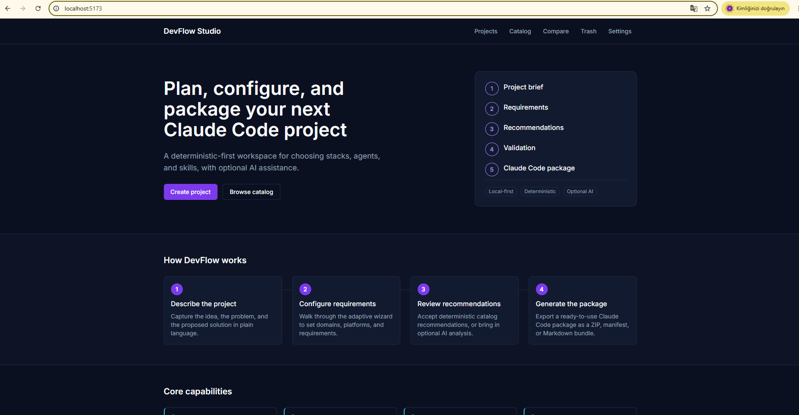
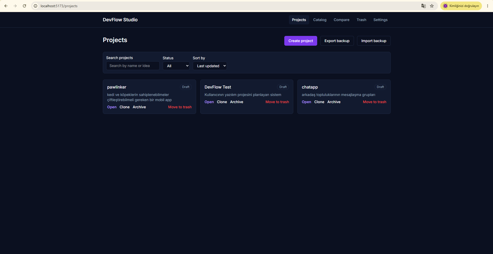
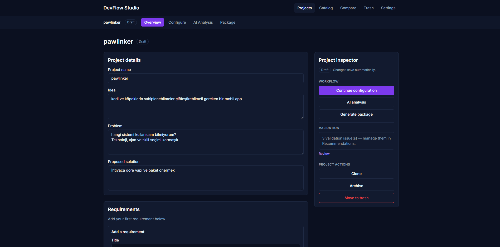
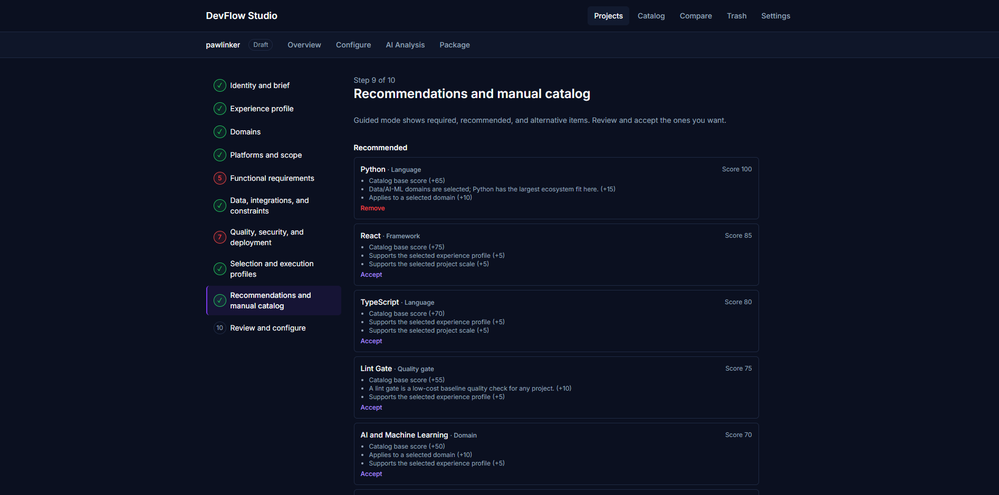
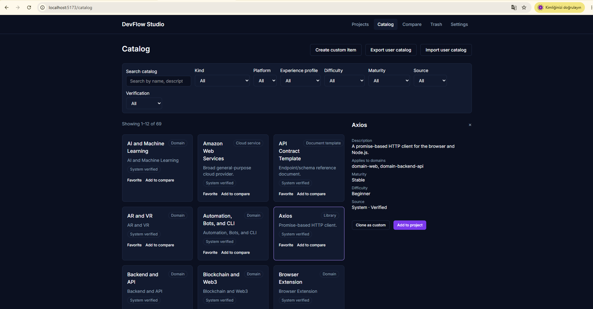
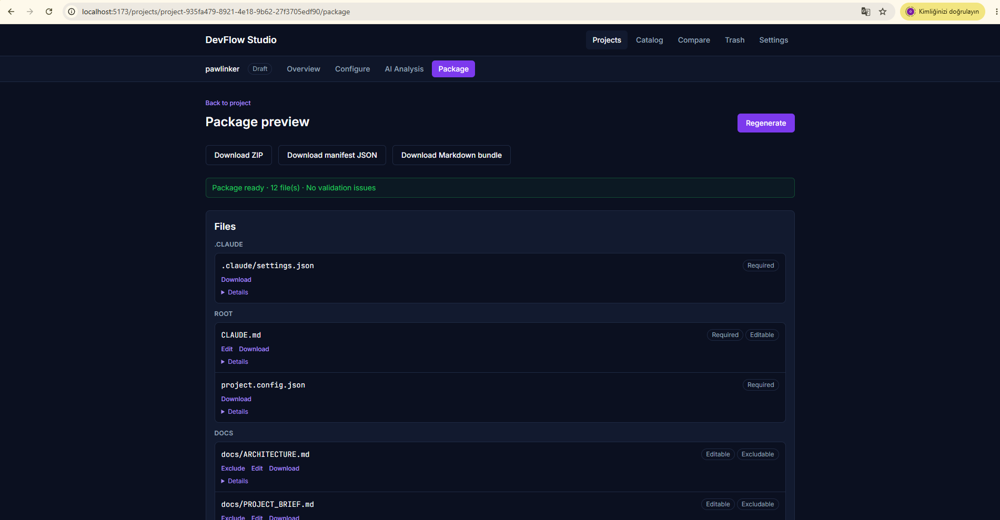

# DevFlow Studio

DevFlow Studio is a local-first web application that helps developers plan a software project: it collects requirements, recommends a technology stack deterministically, lets you compare catalog options, and generates a downloadable starter package — all without a backend or user account.

DevFlow Studio follows a local-first, deterministic-first architecture that keeps core project-planning workflows explainable and independent of external services. AI assistance is entirely optional and off by default.

## Key features

- **Project workspace** — create, list, update, and (soft-)delete projects, each holding requirements, selections, and generated packages.
- **Configuration wizard** — a guided, multi-step flow that captures domain, requirements, and constraints for a project.
- **Deterministic recommendations** — a rules-based recommendation engine scores catalog technologies against the captured requirements; no AI call is required to get a result.
- **Catalog & compare** — browse the built-in technology catalog and compare candidates side by side.
- **Package generation** — produces a downloadable project package (manifest + files) from the confirmed selections.
- **Optional AI assistance** — an opt-in analysis step can call Claude (via a Netlify Function) for an additional narrative review; the app is fully usable with AI disabled.
- **Local persistence** — projects, catalog data, and settings are stored in the browser's `localStorage`; nothing is sent anywhere unless the optional AI step is explicitly used.
- **Localization** — English and Turkish UI translations.
- **Accessibility** — targets WCAG 2.2 AA, with automated axe checks and keyboard-navigation tests in the test suite.

## Local-first / deterministic-first design

Every core workflow — creating a project, running the wizard, getting a recommendation, generating a package — works fully offline using deterministic, rules-based logic and browser storage. No account, database, or network call is required. The only network-dependent feature is the optional AI analysis step, which is clearly opt-in and gracefully disabled when not configured.

## Technology stack

- **Framework:** React 19 + Vite, TypeScript
- **Styling:** Tailwind CSS
- **State:** Zustand
- **Routing:** React Router
- **i18n:** i18next / react-i18next
- **Testing:** Vitest + Testing Library (unit), Playwright (E2E), jest-axe (accessibility)
- **Optional backend:** a single Netlify Function (`netlify/functions/analyze-project`) that proxies an Anthropic API call server-side
- **Hosting target:** Netlify (static SPA + optional serverless function)

## Project architecture summary

The application follows a layered, ports-and-adapters style structure inside `app/src/`:

| Layer | Path | Purpose |
| --- | --- | --- |
| Domain | `app/src/domain/` | Pure business logic: recommendation engine, validation engine, package generator, project rules |
| Application | `app/src/application/` | Zustand stores that orchestrate domain logic and ports |
| Ports | `app/src/ports/` | Repository/service interfaces (architectural boundaries) implemented by adapters |
| Adapters | `app/src/adapters/` | Concrete implementations of ports — `localStorage` repositories, zip/download/hash utilities, the AI client |
| Pages / Components | `app/src/pages/`, `app/src/components/` | React UI |
| Catalog | `app/src/catalog/` | Built-in technology catalog and recommendation rules data |

Shared, implementation-neutral contracts and JSON Schemas live in `contracts/` at the repository root. `contracts/types/` defines shared application contracts, while `app/src/ports/` defines the repository and service interfaces used between the application and its adapters.

## Installation

```bash
npm --prefix app ci
```

## Development command

```bash
npm --prefix app run dev
```

## Production build command

```bash
npm --prefix app run build
```

## Test commands

```bash
npm --prefix app run test          # unit tests (Vitest)
npm --prefix app run test:coverage # unit tests with coverage
npm --prefix app run e2e           # end-to-end tests (Playwright)
npm --prefix app run typecheck
npm --prefix app run lint
```

The optional Netlify Function package has its own checks:

```bash
npm --prefix netlify/functions run typecheck
npm --prefix netlify/functions run test
```

## Project Management

DevFlow Studio provides a complete project-management workflow:

- **Create** new projects from a structured project brief.
- **Browse and list** locally stored projects from the Projects workspace.
- **Update** project details, requirements, configuration, and technology selections.
- **Delete** projects by moving them to trash, with support for restoration or permanent removal.

Project data is persisted through `app/src/ports/projectRepository.ts`, implemented by `app/src/adapters/localStorageProjectAdapter.ts`.

## LocalStorage usage

Projects, catalog overrides, and application settings are persisted entirely in the browser's `localStorage` via dedicated adapter modules (`localStorageProjectAdapter.ts`, `localStorageCatalogAdapter.ts`, `localStorageSettingsAdapter.ts`). No project data is transmitted to a server as part of normal use.

## Catalog & Compare

`CatalogPage` lists the built-in technology catalog (`app/src/catalog/systemCatalog.ts`); `ComparePage` lets you compare selected catalog items side by side before confirming a project's stack.

## Configuration wizard

`ProjectWizardPage` (`app/src/pages/wizard/`) walks through domain selection, requirements capture, and recommendation review in discrete steps, tracked by `WizardStepRail`.

## Deterministic recommendations

`app/src/domain/recommendationEngine.ts` scores catalog technologies against the project's captured requirements using declarative rules (`app/src/catalog/recommendationRules.ts`). This produces a usable, explainable result without calling any external AI service.

## Package generation

`app/src/domain/packageGenerator.ts` builds a downloadable package (manifest plus files, zipped via `fflate`) from the project's confirmed selections, viewable on `PackagePreviewPage` before download.

## Localization

UI strings are translated for English (`en.json`) and Turkish (`tr.json`) under `app/src/i18n/locales/`, driven by i18next. An automated completeness test (`i18nCompleteness.test.ts`) checks both locale files stay in sync.

## Accessibility & testing overview

- Automated accessibility smoke tests using `jest-axe` (`axeSmoke.test.tsx`).
- Keyboard-navigation and theme/i18n end-to-end coverage (`i18n-theme-keyboard.spec.ts`).
- Unit tests (Vitest + Testing Library) cover domain logic, stores, and pages.
- End-to-end tests (Playwright) cover the project lifecycle, wizard, recommendations, catalog/compare, backup import, validation acknowledgement, and package export flows.
- Target: WCAG 2.2 AA.

## Optional Netlify Functions architecture

`netlify/functions/analyze-project` is a single serverless function that proxies an Anthropic API call server-side so no API key is ever exposed to the client. It requires environment variables configured on the hosting platform (never committed to the repository):

| Variable | Required | Purpose |
| --- | --- | --- |
| `ANTHROPIC_API_KEY` | Yes, to enable AI | Server-only Anthropic API key |
| `ANTHROPIC_MODEL` | Yes, to enable AI | Model identifier read at request time |
| `ALLOWED_ORIGIN` | Yes, to enable AI | Exact origin allowed to call the endpoint |

If these are unset, the function returns `AI_DISABLED` and the app continues to work fully in its deterministic, local-only mode.
## Screenshots

### Landing — Product overview

The landing page introduces the DevFlow Studio workflow, from defining a project brief and requirements to reviewing recommendations, validating the configuration, and generating a starter package.



### Projects — Project management

The Projects workspace provides the central project-management experience. Projects can be created, opened, searched, sorted, cloned, archived, or moved to trash while remaining stored locally in the browser.



### Project Overview — Editing and validation

The Project Overview brings project details, requirements, selections, workflow actions, and validation status into a single workspace.



### Wizard — Guided configuration

The multi-step configuration wizard guides a project through domains, platforms, requirements, execution preferences, recommendations, and final review while keeping progress and validation states visible.



### Catalog — Search, inspect, and compare

The Catalog provides searchable and filterable technology, agent, skill, and template entries. Items can be inspected in detail, compared with alternatives, cloned as custom entries, or added to a project.



### Package Preview — Generated starter package

The Package Preview shows the generated starter package before export. Files are grouped by path and can be inspected, edited, excluded where permitted, or downloaded individually, while the complete package can be exported in multiple formats.



## License

See repository owner for licensing terms.
